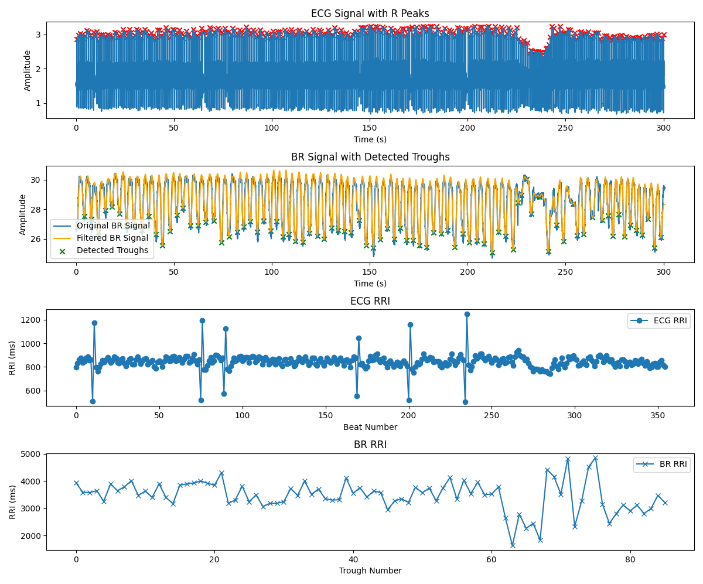

# 心電図(ECG)と呼吸(BR)データからRRIを計算する(RRI calculation)

<p align="center">
  
</p>

## DATE
Tue Dec 10 2024 15:43:58 GMT+0900 (日本標準時)  

## MODE
gpt-4  

## MESSAGES
### [1] user  
心電図(ECG)と呼吸(BR)の波形データを読み込んで、ECGとBRのRRIを計算して時系列変化をグラフ表示して下さい。
ECG波形は、ピーク検出すればRRIが計算できると思います。
呼吸波形は、高い周波数のノイズが含まれるのでフィルターでLPF等でノイズを除去してから、下側のピーク(谷)検出してRRIを計算して下さい。  

### [2] assistant  
心電図(ECG)と呼吸(BR)の波形データを読み込み、RRI（RR間隔）を計算し、時系列変化をグラフ表示するためには、次のステップを踏む必要があります。Pythonを使用してこれを行う方法を説明します。`numpy`、`scipy`、`matplotlib`、および`biosppy`ライブラリを使います。

まず、必要なライブラリをインストールします:

```bash
pip install numpy scipy matplotlib biosppy
```

次に、スクリプトを書きます:

```python
import numpy as np
import matplotlib.pyplot as plt
from scipy.signal import find_peaks, butter, filtfilt
from biosppy.signals import ecg

# 読み込むファイルパス（例）
ecg_file_path = 'ecg_data.csv'
br_file_path = 'br_data.csv'

# データの読み込み
ecg_data = np.loadtxt(ecg_file_path, delimiter=',')
br_data = np.loadtxt(br_file_path, delimiter=',')

# サンプリング周波数の設定 (例: 1000 Hz)
sampling_rate = 1000

# ECGのRピークを検出してRRIを計算
def calculate_rri_ecg(ecg_data, sampling_rate):
    out = ecg.ecg(signal=ecg_data, sampling_rate=sampling_rate, show=False)
    r_peaks = out['rpeaks']
    rri = np.diff(r_peaks) * (1000.0 / sampling_rate)  # RRIをミリ秒に変換
    return rri, r_peaks

# 呼吸波形の前処理：ローパスフィルタでノイズ除去
def preprocess_br_signal(br_data, sampling_rate, cutoff_freq=0.5):
    nyquist_freq = 0.5 * sampling_rate
    normal_cutoff = cutoff_freq / nyquist_freq
    b, a = butter(5, normal_cutoff, btype='low', analog=False)
    filtered_br = filtfilt(b, a, br_data)
    return filtered_br

# 呼吸データから谷を検出してRRIを計算
def calculate_rri_br(filtered_br_data, sampling_rate):
    inverted_br = -1 * filtered_br_data  # 谷の検出のために反転
    peaks, _ = find_peaks(inverted_br, distance=sampling_rate/2)  # 最小距離を設定
    rri = np.diff(peaks) * (1000.0 / sampling_rate)  # RRIをミリ秒に変換
    return rri, peaks

# 計算
ecg_rri, ecg_peaks = calculate_rri_ecg(ecg_data, sampling_rate)
filtered_br_data = preprocess_br_signal(br_data, sampling_rate)
br_rri, br_peaks = calculate_rri_br(filtered_br_data, sampling_rate)

# グラフ表示
plt.figure(figsize=(12, 8))

plt.subplot(3, 1, 1)
plt.plot(ecg_data)
plt.scatter(ecg_peaks, ecg_data[ecg_peaks], color='red', marker='x')
plt.title('ECG Signal with R Peaks')
plt.xlabel('Samples')
plt.ylabel('Amplitude')

plt.subplot(3, 1, 2)
plt.plot(br_data, label='Original BR Signal')
plt.plot(filtered_br_data, label='Filtered BR Signal', color='orange')
plt.scatter(br_peaks, filtered_br_data[br_peaks], color='green', marker='x', label='Detected Troughs')
plt.title('BR Signal with Detected Troughs')
plt.xlabel('Samples')
plt.ylabel('Amplitude')
plt.legend()

plt.subplot(3, 1, 3)
plt.plot(ecg_rri, label='ECG RRI', marker='o')
plt.plot(br_rri, label='BR RRI', marker='x')
plt.title('RRI of ECG and BR')
plt.xlabel('Beat Number')
plt.ylabel('RRI (ms)')
plt.legend()

plt.tight_layout()
plt.show()
```

このスクリプトは以下のことを行います。
1. CSVファイルからECGとBRのデータを読み込みます。
2. ECGデータからRピークを検出し、RRIを計算します。
3. 呼吸（BR）データをローパスフィルターで前処理し、谷を検出してRRIを計算します。
4. 結果をプロットし、ECG信号、フィルタリングされた呼吸信号、そしてそれぞれのRRIを時系列で表示します。

注意: サンプルデータやサンプリングレートに応じて、変数（例: `sampling_rate`）やピーク検出の閾値は調整が必要です。  

### [3] user  
ECGデータとBRデータは230907_呼吸・心電分析-2.csvのECG列とBR列に入ってます。  

### [4] assistant  
了解しました。ファイルからECGデータとBRデータを直接読み込むようにスクリプトを調整しましょう。この場合、Pandasを使ってCSVファイルを読み込むのが便利です。まず、Pandasライブラリが必要なので、インストールされていない場合は次のコマンドでインストールしてください。

```bash
pip install pandas
```

次に、スクリプトを以下のように修正して、CSVファイルからデータを読み込みます。

```python
import numpy as np
import matplotlib.pyplot as plt
from scipy.signal import find_peaks, butter, filtfilt
from biosppy.signals import ecg
import pandas as pd

# CSVファイルのパス
file_path = '230907_呼吸・心電分析-2.csv'

# CSVファイルからデータを読み込む
data = pd.read_csv(file_path)

# ECGとBRのデータを抽出
ecg_data = data['ECG'].values
br_data = data['BR'].values

# サンプリング周波数の設定（例: 1000 Hz）
sampling_rate = 1000

# ECGのRピークを検出してRRIを計算
def calculate_rri_ecg(ecg_data, sampling_rate):
    out = ecg.ecg(signal=ecg_data, sampling_rate=sampling_rate, show=False)
    r_peaks = out['rpeaks']
    rri = np.diff(r_peaks) * (1000.0 / sampling_rate)  # RRIをミリ秒に変換
    return rri, r_peaks

# 呼吸波形の前処理：ローパスフィルタでノイズ除去
def preprocess_br_signal(br_data, sampling_rate, cutoff_freq=0.5):
    nyquist_freq = 0.5 * sampling_rate
    normal_cutoff = cutoff_freq / nyquist_freq
    b, a = butter(5, normal_cutoff, btype='low', analog=False)
    filtered_br = filtfilt(b, a, br_data)
    return filtered_br

# 呼吸データから谷を検出してRRIを計算
def calculate_rri_br(filtered_br_data, sampling_rate):
    inverted_br = -1 * filtered_br_data  # 谷の検出のために反転
    peaks, _ = find_peaks(inverted_br, distance=sampling_rate/2)  # 最小距離を設定
    rri = np.diff(peaks) * (1000.0 / sampling_rate)  # RRIをミリ秒に変換
    return rri, peaks

# 計算
ecg_rri, ecg_peaks = calculate_rri_ecg(ecg_data, sampling_rate)
filtered_br_data = preprocess_br_signal(br_data, sampling_rate)
br_rri, br_peaks = calculate_rri_br(filtered_br_data, sampling_rate)

# グラフ表示
plt.figure(figsize=(12, 8))

plt.subplot(3, 1, 1)
plt.plot(ecg_data)
plt.scatter(ecg_peaks, ecg_data[ecg_peaks], color='red', marker='x')
plt.title('ECG Signal with R Peaks')
plt.xlabel('Samples')
plt.ylabel('Amplitude')

plt.subplot(3, 1, 2)
plt.plot(br_data, label='Original BR Signal')
plt.plot(filtered_br_data, label='Filtered BR Signal', color='orange')
plt.scatter(br_peaks, filtered_br_data[br_peaks], color='green', marker='x', label='Detected Troughs')
plt.title('BR Signal with Detected Troughs')
plt.xlabel('Samples')
plt.ylabel('Amplitude')
plt.legend()

plt.subplot(3, 1, 3)
plt.plot(ecg_rri, label='ECG RRI', marker='o')
plt.plot(br_rri, label='BR RRI', marker='x')
plt.title('RRI of ECG and BR')
plt.xlabel('Beat Number')
plt.ylabel('RRI (ms)')
plt.legend()

plt.tight_layout()
plt.show()
```

このスクリプトでは、指定されたCSVファイルからデータを読み取り、ECG列とBR列をそれぞれの配列に変換します。その後、各アレイを処理してRRIを計算し、グラフにプロットします。サンプリングレートやその他のパラメータがデフォルト値でない場合は、適宜変更する必要があります。  

### [5] user  
下記エラーが出ました
インポート "biosppy.signals" を解決できませんでした  

### [6] assistant  
"biosppy"パッケージがインストールされていないか、インポートに問題がある可能性があります。まず、このパッケージが正しくインストールされていることを確認してください。次のコマンドを使用してインストールを試みてください。

```bash
pip install biosppy
```

もしすでにインストール済みであるにもかかわらずエラーが発生する場合や、他の手法が必要な場合は、「biosppy」ライブラリの代わりに「scipy」を使用してRピークを検出できます。以下のようにスクリプトを修正します：

```python
import numpy as np
import matplotlib.pyplot as plt
from scipy.signal import find_peaks, butter, filtfilt
import pandas as pd

# CSVファイルのパス
file_path = '230907_呼吸・心電分析-2.csv'

# CSVファイルからデータを読み込む
data = pd.read_csv(file_path)

# ECGとBRのデータを抽出
ecg_data = data['ECG'].values
br_data = data['BR'].values

# サンプリング周波数の設定（例: 1000 Hz）
sampling_rate = 1000

# ECGのRピークを検出してRRIを計算
def calculate_rri_ecg(ecg_data, sampling_rate):
    # Rピークを検出 (しきい値や最小距離は適宜調整)
    peaks, _ = find_peaks(ecg_data, distance=sampling_rate/2, height=np.mean(ecg_data))
    rri = np.diff(peaks) * (1000.0 / sampling_rate)  # RRIをミリ秒に変換
    return rri, peaks

# 呼吸波形の前処理：ローパスフィルタでノイズ除去
def preprocess_br_signal(br_data, sampling_rate, cutoff_freq=0.5):
    nyquist_freq = 0.5 * sampling_rate
    normal_cutoff = cutoff_freq / nyquist_freq
    b, a = butter(5, normal_cutoff, btype='low', analog=False)
    filtered_br = filtfilt(b, a, br_data)
    return filtered_br

# 呼吸データから谷を検出してRRIを計算
def calculate_rri_br(filtered_br_data, sampling_rate):
    inverted_br = -1 * filtered_br_data  # 谷の検出のために反転
    peaks, _ = find_peaks(inverted_br, distance=sampling_rate/2)  # 最小距離を設定
    rri = np.diff(peaks) * (1000.0 / sampling_rate)  # RRIをミリ秒に変換
    return rri, peaks

# 計算
ecg_rri, ecg_peaks = calculate_rri_ecg(ecg_data, sampling_rate)
filtered_br_data = preprocess_br_signal(br_data, sampling_rate)
br_rri, br_peaks = calculate_rri_br(filtered_br_data, sampling_rate)

# グラフ表示
plt.figure(figsize=(12, 8))

plt.subplot(3, 1, 1)
plt.plot(ecg_data)
plt.scatter(ecg_peaks, ecg_data[ecg_peaks], color='red', marker='x')
plt.title('ECG Signal with R Peaks')
plt.xlabel('Samples')
plt.ylabel('Amplitude')

plt.subplot(3, 1, 2)
plt.plot(br_data, label='Original BR Signal')
plt.plot(filtered_br_data, label='Filtered BR Signal', color='orange')
plt.scatter(br_peaks, filtered_br_data[br_peaks], color='green', marker='x', label='Detected Troughs')
plt.title('BR Signal with Detected Troughs')
plt.xlabel('Samples')
plt.ylabel('Amplitude')
plt.legend()

plt.subplot(3, 1, 3)
plt.plot(ecg_rri, label='ECG RRI', marker='o')
plt.plot(br_rri, label='BR RRI', marker='x')
plt.title('RRI of ECG and BR')
plt.xlabel('Beat Number')
plt.ylabel('RRI (ms)')
plt.legend()

plt.tight_layout()
plt.show()
```

このコードでは、`scipy.signal.find_peaks` を使用して Rピークを検出しています。しきい値 (`height`) や最小距離 (`distance`) のパラメータは、データに基づいて調整が必要です。これにより、`biosppy`パッケージがなくてもECGのRRIを計算できるようになります。  

### [7] user  
OK！入力データのCSVファイルには時間データtimeが入ってますので利用して下さい  

### [8] assistant  
時間データがCSVファイルに含まれている場合、それを利用してより正確なRRI計算が可能です。時間データを使用して、サンプリング周波数の推定や異なるサンプリングレートでの処理ができます。

次のようにスクリプトを修正して、時間データを考慮に入れましょう。

```python
import numpy as np
import matplotlib.pyplot as plt
from scipy.signal import find_peaks, butter, filtfilt
import pandas as pd

# CSVファイルのパス
file_path = '230907_呼吸・心電分析-2.csv'

# CSVファイルからデータを読み込む
data = pd.read_csv(file_path)

# 時間データ、ECG、BRの列を抽出
time_data = data['time'].values
ecg_data = data['ECG'].values
br_data = data['BR'].values

# サンプリング周波数の計算
# 時間差からサンプル間隔を取り、頻度を求める
time_diff = np.diff(time_data)
if len(time_diff) > 0:
    sampling_rate = 1 / np.mean(time_diff)
else:
    raise ValueError("時間データが不十分です。")

# ECGのRピークを検出してRRIを計算
def calculate_rri_ecg(ecg_data, time_data):
    peaks, _ = find_peaks(ecg_data, distance=sampling_rate/2, height=np.mean(ecg_data))
    rri = np.diff(time_data[peaks]) * 1000.0  # RRIをミリ秒に変換
    return rri, peaks

# 呼吸波形の前処理：ローパスフィルタでノイズ除去
def preprocess_br_signal(br_data, cutoff_freq=0.5):
    nyquist_freq = 0.5 * sampling_rate
    normal_cutoff = cutoff_freq / nyquist_freq
    b, a = butter(5, normal_cutoff, btype='low', analog=False)
    filtered_br = filtfilt(b, a, br_data)
    return filtered_br

# 呼吸データから谷を検出してRRIを計算
def calculate_rri_br(filtered_br_data, time_data):
    inverted_br = -1 * filtered_br_data  # 谷の検出のために反転
    peaks, _ = find_peaks(inverted_br, distance=sampling_rate/2)
    rri = np.diff(time_data[peaks]) * 1000.0  # RRIをミリ秒に変換
    return rri, peaks

# 計算
ecg_rri, ecg_peaks = calculate_rri_ecg(ecg_data, time_data)
filtered_br_data = preprocess_br_signal(br_data)
br_rri, br_peaks = calculate_rri_br(filtered_br_data, time_data)

# グラフ表示
plt.figure(figsize=(12, 8))

plt.subplot(3, 1, 1)
plt.plot(time_data, ecg_data)
plt.scatter(time_data[ecg_peaks], ecg_data[ecg_peaks], color='red', marker='x')
plt.title('ECG Signal with R Peaks')
plt.xlabel('Time (s)')
plt.ylabel('Amplitude')

plt.subplot(3, 1, 2)
plt.plot(time_data, br_data, label='Original BR Signal')
plt.plot(time_data, filtered_br_data, label='Filtered BR Signal', color='orange')
plt.scatter(time_data[br_peaks], filtered_br_data[br_peaks], color='green', marker='x', label='Detected Troughs')
plt.title('BR Signal with Detected Troughs')
plt.xlabel('Time (s)')
plt.ylabel('Amplitude')
plt.legend()

plt.subplot(3, 1, 3)
plt.plot(ecg_rri, label='ECG RRI', marker='o')
plt.plot(br_rri, label='BR RRI', marker='x')
plt.title('RRI of ECG and BR')
plt.xlabel('Beat/Trough Number')
plt.ylabel('RRI (ms)')
plt.legend()

plt.tight_layout()
plt.show()
```

### 修正内容：
1. **時間データを使用**：`time`列を利用して、サンプリングレートの推定とRRIの計算に使用しています。
2. **サンプリング周波数の推定**：時間差から平均的なサンプル間隔を算出し、サンプリングレートを推定しています。
3. **プロットでの時間軸**：グラフのX軸もサンプル数ではなく、時間（秒）としてプロットされています。

この方法は、サンプリング間隔が均一でない場合や、サンプリングレートが未知の場合に特に有効です。  

### [9] user  
OK!　RRIのグラフはECGとBRを別々にプロットして下さい。  

### [10] assistant  
了解しました。それでは、ECGとBRのRRIを別々のプロットとして表示するようにコードを修正します。

```python
import numpy as np
import matplotlib.pyplot as plt
from scipy.signal import find_peaks, butter, filtfilt
import pandas as pd

# CSVファイルのパス
file_path = '230907_呼吸・心電分析-2.csv'

# CSVファイルからデータを読み込む
data = pd.read_csv(file_path)

# 時間データ、ECG、BRの列を抽出
time_data = data['time'].values
ecg_data = data['ECG'].values
br_data = data['BR'].values

# サンプリング周波数の計算
time_diff = np.diff(time_data)
if len(time_diff) > 0:
    sampling_rate = 1 / np.mean(time_diff)
else:
    raise ValueError("時間データが不十分です。")

# ECGのRピークを検出してRRIを計算
def calculate_rri_ecg(ecg_data, time_data):
    peaks, _ = find_peaks(ecg_data, distance=sampling_rate/2, height=np.mean(ecg_data))
    rri = np.diff(time_data[peaks]) * 1000.0  # RRIをミリ秒に変換
    return rri, peaks

# 呼吸波形の前処理：ローパスフィルタでノイズ除去
def preprocess_br_signal(br_data, cutoff_freq=0.5):
    nyquist_freq = 0.5 * sampling_rate
    normal_cutoff = cutoff_freq / nyquist_freq
    b, a = butter(5, normal_cutoff, btype='low', analog=False)
    filtered_br = filtfilt(b, a, br_data)
    return filtered_br

# 呼吸データから谷を検出してRRIを計算
def calculate_rri_br(filtered_br_data, time_data):
    inverted_br = -1 * filtered_br_data  # 谷の検出のために反転
    peaks, _ = find_peaks(inverted_br, distance=sampling_rate/2)
    rri = np.diff(time_data[peaks]) * 1000.0  # RRIをミリ秒に変換
    return rri, peaks

# 計算
ecg_rri, ecg_peaks = calculate_rri_ecg(ecg_data, time_data)
filtered_br_data = preprocess_br_signal(br_data)
br_rri, br_peaks = calculate_rri_br(filtered_br_data, time_data)

# グラフ表示
plt.figure(figsize=(12, 10))

plt.subplot(4, 1, 1)
plt.plot(time_data, ecg_data)
plt.scatter(time_data[ecg_peaks], ecg_data[ecg_peaks], color='red', marker='x')
plt.title('ECG Signal with R Peaks')
plt.xlabel('Time (s)')
plt.ylabel('Amplitude')

plt.subplot(4, 1, 2)
plt.plot(time_data, br_data, label='Original BR Signal')
plt.plot(time_data, filtered_br_data, label='Filtered BR Signal', color='orange')
plt.scatter(time_data[br_peaks], filtered_br_data[br_peaks], color='green', marker='x', label='Detected Troughs')
plt.title('BR Signal with Detected Troughs')
plt.xlabel('Time (s)')
plt.ylabel('Amplitude')
plt.legend()

plt.subplot(4, 1, 3)
plt.plot(ecg_rri, label='ECG RRI', marker='o')
plt.title('ECG RRI')
plt.xlabel('Beat Number')
plt.ylabel('RRI (ms)')
plt.legend()

plt.subplot(4, 1, 4)
plt.plot(br_rri, label='BR RRI', marker='x')
plt.title('BR RRI')
plt.xlabel('Trough Number')
plt.ylabel('RRI (ms)')
plt.legend()

plt.tight_layout()
plt.show()
```

### 修正内容：
- **RRIプロットを分離**: `ECG RRI`と`BR RRI`を分けてプロットしています。
- それぞれのプロットに対応するタイトルとラベルを追加しました。

これにより、ECGとBRのRRIが別々にグラフとして表示され、比較しやすくなります。また、入力データや処理に応じて、プロットの詳細なラベルや設定を適宜調整してください。  

### [11] user  
RRIのグラフの横軸を時間にして下さい  

### [12] assistant  
了解しました。RRIのグラフの横軸を時間にするためには、各RRIが計算された時刻を利用する必要があります。ECGとBRそれぞれのRRIが発生したタイミングを求め、それを使ってプロットします。

以下のようにスクリプトを修正します。

```python
import numpy as np
import matplotlib.pyplot as plt
from scipy.signal import find_peaks, butter, filtfilt
import pandas as pd

# CSVファイルのパス
file_path = '230907_呼吸・心電分析-2.csv'

# CSVファイルからデータを読み込む
data = pd.read_csv(file_path)

# 時間データ、ECG、BRの列を抽出
time_data = data['time'].values
ecg_data = data['ECG'].values
br_data = data['BR'].values

# サンプリング周波数の計算
time_diff = np.diff(time_data)
if len(time_diff) > 0:
    sampling_rate = 1 / np.mean(time_diff)
else:
    raise ValueError("時間データが不十分です。")

# ECGのRピークを検出してRRIを計算
def calculate_rri_ecg(ecg_data, time_data):
    peaks, _ = find_peaks(ecg_data, distance=sampling_rate/2, height=np.mean(ecg_data))
    rri = np.diff(time_data[peaks]) * 1000.0  # RRIをミリ秒に変換
    rri_times = time_data[peaks][1:]  # RRIに対応する時間を取得
    return rri, rri_times

# 呼吸波形の前処理：ローパスフィルタでノイズ除去
def preprocess_br_signal(br_data, cutoff_freq=0.5):
    nyquist_freq = 0.5 * sampling_rate
    normal_cutoff = cutoff_freq / nyquist_freq
    b, a = butter(5, normal_cutoff, btype='low', analog=False)
    filtered_br = filtfilt(b, a, br_data)
    return filtered_br

# 呼吸データから谷を検出してRRIを計算
def calculate_rri_br(filtered_br_data, time_data):
    inverted_br = -1 * filtered_br_data  # 谷の検出のために反転
    peaks, _ = find_peaks(inverted_br, distance=sampling_rate/2)
    rri = np.diff(time_data[peaks]) * 1000.0  # RRIをミリ秒に変換
    rri_times = time_data[peaks][1:]  # RRIに対応する時間を取得
    return rri, rri_times

# 計算
ecg_rri, ecg_rri_times = calculate_rri_ecg(ecg_data, time_data)
filtered_br_data = preprocess_br_signal(br_data)
br_rri, br_rri_times = calculate_rri_br(filtered_br_data, time_data)

# グラフ表示
plt.figure(figsize=(12, 10))

plt.subplot(4, 1, 1)
plt.plot(time_data, ecg_data)
plt.scatter(time_data[ecg_peaks], ecg_data[ecg_peaks], color='red', marker='x')
plt.title('ECG Signal with R Peaks')
plt.xlabel('Time (s)')
plt.ylabel('Amplitude')

plt.subplot(4, 1, 2)
plt.plot(time_data, br_data, label='Original BR Signal')
plt.plot(time_data, filtered_br_data, label='Filtered BR Signal', color='orange')
plt.scatter(time_data[br_peaks], filtered_br_data[br_peaks], color='green', marker='x', label='Detected Troughs')
plt.title('BR Signal with Detected Troughs')
plt.xlabel('Time (s)')
plt.ylabel('Amplitude')
plt.legend()

plt.subplot(4, 1, 3)
plt.plot(ecg_rri_times, ecg_rri, label='ECG RRI', marker='o')
plt.title('ECG RRI')
plt.xlabel('Time (s)')
plt.ylabel('RRI (ms)')
plt.legend()

plt.subplot(4, 1, 4)
plt.plot(br_rri_times, br_rri, label='BR RRI', marker='x')
plt.title('BR RRI')
plt.xlabel('Time (s)')
plt.ylabel('RRI (ms)')
plt.legend()

plt.tight_layout()
plt.show()
```

### 修正内容：
- **RRIと時間の対応**: RRIの計算結果に対応する時間データ (`rri_times`) をもとにプロットします。
- プロットの横軸を「Beat Number」から「Time (s)」に変更し、RRIが発生した時刻をX軸に表示します。

これにより、時間軸に基づいたRRIの変化を可視化できます。必要に応じてその他の設定は適宜調整してください。  

### [13] user  
下記エラー出ました
Traceback (most recent call last):
  File "c:\Users\abe\Desktop\心拍と呼吸のRRI計算\心拍と呼吸のRRI計算.py", line 57, in <module>
    plt.scatter(time_data[ecg_peaks], ecg_data[ecg_peaks], color='red', marker='x')
                          ^^^^^^^^^
NameError: name 'ecg_peaks' is not defined  

### [14] assistant  
申し訳ありません。`ecg_peaks`と`br_peaks`の変数が必要ですが、それらを取得するためのコードが抜けていました。この部分を修正しましょう。

以下は修正されたコードです：

```python
import numpy as np
import matplotlib.pyplot as plt
from scipy.signal import find_peaks, butter, filtfilt
import pandas as pd

# CSVファイルのパス
file_path = '230907_呼吸・心電分析-2.csv'

# CSVファイルからデータを読み込む
data = pd.read_csv(file_path)

# 時間データ、ECG、BRの列を抽出
time_data = data['time'].values
ecg_data = data['ECG'].values
br_data = data['BR'].values

# サンプリング周波数の計算
time_diff = np.diff(time_data)
if len(time_diff) > 0:
    sampling_rate = 1 / np.mean(time_diff)
else:
    raise ValueError("時間データが不十分です。")

# ECGのRピークを検出してRRIを計算
def calculate_rri_ecg(ecg_data, time_data):
    peaks, _ = find_peaks(ecg_data, distance=sampling_rate/2, height=np.mean(ecg_data))
    rri = np.diff(time_data[peaks]) * 1000.0  # RRIをミリ秒に変換
    rri_times = time_data[peaks][1:]  # RRIに対応する時間を取得
    return rri, rri_times, peaks

# 呼吸波形の前処理：ローパスフィルタでノイズ除去
def preprocess_br_signal(br_data, cutoff_freq=0.5):
    nyquist_freq = 0.5 * sampling_rate
    normal_cutoff = cutoff_freq / nyquist_freq
    b, a = butter(5, normal_cutoff, btype='low', analog=False)
    filtered_br = filtfilt(b, a, br_data)
    return filtered_br

# 呼吸データから谷を検出してRRIを計算
def calculate_rri_br(filtered_br_data, time_data):
    inverted_br = -1 * filtered_br_data  # 谷の検出のために反転
    peaks, _ = find_peaks(inverted_br, distance=sampling_rate/2)
    rri = np.diff(time_data[peaks]) * 1000.0  # RRIをミリ秒に変換
    rri_times = time_data[peaks][1:]  # RRIに対応する時間を取得
    return rri, rri_times, peaks

# 計算
ecg_rri, ecg_rri_times, ecg_peaks = calculate_rri_ecg(ecg_data, time_data)
filtered_br_data = preprocess_br_signal(br_data)
br_rri, br_rri_times, br_peaks = calculate_rri_br(filtered_br_data, time_data)

# グラフ表示
plt.figure(figsize=(12, 10))

plt.subplot(4, 1, 1)
plt.plot(time_data, ecg_data)
plt.scatter(time_data[ecg_peaks], ecg_data[ecg_peaks], color='red', marker='x')
plt.title('ECG Signal with R Peaks')
plt.xlabel('Time (s)')
plt.ylabel('Amplitude')

plt.subplot(4, 1, 2)
plt.plot(time_data, br_data, label='Original BR Signal')
plt.plot(time_data, filtered_br_data, label='Filtered BR Signal', color='orange')
plt.scatter(time_data[br_peaks], filtered_br_data[br_peaks], color='green', marker='x', label='Detected Troughs')
plt.title('BR Signal with Detected Troughs')
plt.xlabel('Time (s)')
plt.ylabel('Amplitude')
plt.legend()

plt.subplot(4, 1, 3)
plt.plot(ecg_rri_times, ecg_rri, label='ECG RRI', marker='o')
plt.title('ECG RRI')
plt.xlabel('Time (s)')
plt.ylabel('RRI (ms)')
plt.legend()

plt.subplot(4, 1, 4)
plt.plot(br_rri_times, br_rri, label='BR RRI', marker='x')
plt.title('BR RRI')
plt.xlabel('Time (s)')
plt.ylabel('RRI (ms)')
plt.legend()

plt.tight_layout()
plt.show()
```

### 修正内容：
- `calculate_rri_ecg`と`calculate_rri_br`関数の戻り値として、ピークのインデックス（`peaks`）を追加しました。
- `peaks`変数を利用してプロットでピークを示す注釈を追加しました。

これでエラーが解決し、期待通りにプロットされるはずです。必要に応じて、パラメータやプロットの設定を調整してください。  

### [15] user  
OK！ECGのRRIとBRのRRIを一つのCSVファイルで出力して下さい。出力するCSVファイルの時間軸は入力ファイルと同じにして下さい。  

### [16] assistant  
了解しました。ECGとBRのRRIをCSVファイルに出力するためには、入力ファイルと同じ時間軸で結果を整列する必要があります。この場合、計算されたRRIの時刻をもとに、可能な範囲で入力ファイルの時間軸に基づいたデータにする方法を考えます。

以下のスクリプトは、計算されたRRIを新しいCSVファイルに出力する手順を含んでいます：

```python
import numpy as np
import matplotlib.pyplot as plt
from scipy.signal import find_peaks, butter, filtfilt
import pandas as pd

# CSVファイルのパスを設定
input_file_path = '230907_呼吸・心電分析-2.csv'
output_file_path = 'RRI_output.csv'

# CSVファイルからデータを読み込む
data = pd.read_csv(input_file_path)

# 時間データ、ECG、BRの列を抽出
time_data = data['time'].values
ecg_data = data['ECG'].values
br_data = data['BR'].values

# サンプリング周波数の計算
time_diff = np.diff(time_data)
if len(time_diff) > 0:
    sampling_rate = 1 / np.mean(time_diff)
else:
    raise ValueError("時間データが不十分です。")

# ECGのRピークを検出してRRIを計算
def calculate_rri_ecg(ecg_data, time_data):
    peaks, _ = find_peaks(ecg_data, distance=sampling_rate/2, height=np.mean(ecg_data))
    rri = np.diff(time_data[peaks]) * 1000.0  # RRIをミリ秒に変換
    rri_times = time_data[peaks][1:]  # RRIに対応する時間を取得
    return rri, rri_times, peaks

# 呼吸波形の前処理：ローパスフィルタでノイズ除去
def preprocess_br_signal(br_data, cutoff_freq=0.5):
    nyquist_freq = 0.5 * sampling_rate
    normal_cutoff = cutoff_freq / nyquist_freq
    b, a = butter(5, normal_cutoff, btype='low', analog=False)
    filtered_br = filtfilt(b, a, br_data)
    return filtered_br

# 呼吸データから谷を検出してRRIを計算
def calculate_rri_br(filtered_br_data, time_data):
    inverted_br = -1 * filtered_br_data  # 谷の検出のために反転
    peaks, _ = find_peaks(inverted_br, distance=sampling_rate/2)
    rri = np.diff(time_data[peaks]) * 1000.0  # RRIをミリ秒に変換
    rri_times = time_data[peaks][1:]  # RRIに対応する時間を取得
    return rri, rri_times, peaks

# 計算
ecg_rri, ecg_rri_times, ecg_peaks = calculate_rri_ecg(ecg_data, time_data)
filtered_br_data = preprocess_br_signal(br_data)
br_rri, br_rri_times, br_peaks = calculate_rri_br(filtered_br_data, time_data)

# RRI データを時間軸に沿ってマージ
rri_df = pd.DataFrame({'time': time_data})
rri_df['ECG_RRI'] = np.nan
rri_df['BR_RRI'] = np.nan

# 各時間ポイントに対応する最も近いRRIを埋める
rri_df.loc[np.isin(rri_df['time'], ecg_rri_times), 'ECG_RRI'] = ecg_rri
rri_df.loc[np.isin(rri_df['time'], br_rri_times), 'BR_RRI'] = br_rri

# CSVに出力
rri_df.to_csv(output_file_path, index=False)

# グラフ表示
plt.figure(figsize=(12, 10))

plt.subplot(4, 1, 1)
plt.plot(time_data, ecg_data)
plt.scatter(time_data[ecg_peaks], ecg_data[ecg_peaks], color='red', marker='x')
plt.title('ECG Signal with R Peaks')
plt.xlabel('Time (s)')
plt.ylabel('Amplitude')

plt.subplot(4, 1, 2)
plt.plot(time_data, br_data, label='Original BR Signal')
plt.plot(time_data, filtered_br_data, label='Filtered BR Signal', color='orange')
plt.scatter(time_data[br_peaks], filtered_br_data[br_peaks], color='green', marker='x', label='Detected Troughs')
plt.title('BR Signal with Detected Troughs')
plt.xlabel('Time (s)')
plt.ylabel('Amplitude')
plt.legend()

plt.subplot(4, 1, 3)
plt.plot(ecg_rri_times, ecg_rri, label='ECG RRI', marker='o')
plt.title('ECG RRI')
plt.xlabel('Time (s)')
plt.ylabel('RRI (ms)')
plt.legend()

plt.subplot(4, 1, 4)
plt.plot(br_rri_times, br_rri, label='BR RRI', marker='x')
plt.title('BR RRI')
plt.xlabel('Time (s)')
plt.ylabel('RRI (ms)')
plt.legend()

plt.tight_layout()
plt.show()
```

### 修正内容：
- **RRIの保存**: 新しいDataFrame (`rri_df`) を作成し、`time`軸を基準にECGとBRのRRIを整列します。
- **NaNの処理**: `rri_df`にRRIの計算結果を挿入するとき、時間が一致しているものだけを埋めるようにしました。
- **CSVへの書き出し**: RRIのデータを`RRI_output.csv`という名前で出力します。

この方法により、出力されるCSVファイルは元の時間データと整合した形式になり、視覚的に確認できるRRIの変化が時系列として示されます。必要に応じて、さらなる処理や解析のためにこのレイアウトを使うことができます。  

### [17] user  
ECGのRRIとBRのRRIのCSVファイルを見ると空白のデータ行がありました。空白のデータは補完して埋めて下さい  

### [18] assistant  
空白のデータを補完するためには、適切な方法を選んで欠損値（NaN）を埋める必要があります。線形補完は一般的なアプローチです。Pandasの`interpolate`関数を使用してこれを行うことができます。

以下に、RRIデータを補完するコードを追加した修正版を示します：

```python
import numpy as np
import matplotlib.pyplot as plt
from scipy.signal import find_peaks, butter, filtfilt
import pandas as pd

# CSVファイルのパスを設定
input_file_path = '230907_呼吸・心電分析-2.csv'
output_file_path = 'RRI_output.csv'

# CSVファイルからデータを読み込む
data = pd.read_csv(input_file_path)

# 時間データ、ECG、BRの列を抽出
time_data = data['time'].values
ecg_data = data['ECG'].values
br_data = data['BR'].values

# サンプリング周波数の計算
time_diff = np.diff(time_data)
if len(time_diff) > 0:
    sampling_rate = 1 / np.mean(time_diff)
else:
    raise ValueError("時間データが不十分です。")

# ECGのRピークを検出してRRIを計算
def calculate_rri_ecg(ecg_data, time_data):
    peaks, _ = find_peaks(ecg_data, distance=sampling_rate/2, height=np.mean(ecg_data))
    rri = np.diff(time_data[peaks]) * 1000.0  # RRIをミリ秒に変換
    rri_times = time_data[peaks][1:]  # RRIに対応する時間を取得
    return rri, rri_times, peaks

# 呼吸波形の前処理：ローパスフィルタでノイズ除去
def preprocess_br_signal(br_data, cutoff_freq=0.5):
    nyquist_freq = 0.5 * sampling_rate
    normal_cutoff = cutoff_freq / nyquist_freq
    b, a = butter(5, normal_cutoff, btype='low', analog=False)
    filtered_br = filtfilt(b, a, br_data)
    return filtered_br

# 呼吸データから谷を検出してRRIを計算
def calculate_rri_br(filtered_br_data, time_data):
    inverted_br = -1 * filtered_br_data  # 谷の検出のために反転
    peaks, _ = find_peaks(inverted_br, distance=sampling_rate/2)
    rri = np.diff(time_data[peaks]) * 1000.0  # RRIをミリ秒に変換
    rri_times = time_data[peaks][1:]  # RRIに対応する時間を取得
    return rri, rri_times, peaks

# 計算
ecg_rri, ecg_rri_times, ecg_peaks = calculate_rri_ecg(ecg_data, time_data)
filtered_br_data = preprocess_br_signal(br_data)
br_rri, br_rri_times, br_peaks = calculate_rri_br(filtered_br_data, time_data)

# RRI データを時間軸に沿ってマージ
rri_df = pd.DataFrame({'time': time_data})
rri_df['ECG_RRI'] = np.nan
rri_df['BR_RRI'] = np.nan

# 各時間ポイントに対応する最も近いRRIを埋める
rri_df.loc[np.isin(rri_df['time'], ecg_rri_times), 'ECG_RRI'] = ecg_rri
rri_df.loc[np.isin(rri_df['time'], br_rri_times), 'BR_RRI'] = br_rri

# 欠損値を線形補完で埋める
rri_df['ECG_RRI'] = rri_df['ECG_RRI'].interpolate(method='linear')
rri_df['BR_RRI'] = rri_df['BR_RRI'].interpolate(method='linear')

# CSVに出力
rri_df.to_csv(output_file_path, index=False)

# グラフ表示
plt.figure(figsize=(12, 10))

plt.subplot(4, 1, 1)
plt.plot(time_data, ecg_data)
plt.scatter(time_data[ecg_peaks], ecg_data[ecg_peaks], color='red', marker='x')
plt.title('ECG Signal with R Peaks')
plt.xlabel('Time (s)')
plt.ylabel('Amplitude')

plt.subplot(4, 1, 2)
plt.plot(time_data, br_data, label='Original BR Signal')
plt.plot(time_data, filtered_br_data, label='Filtered BR Signal', color='orange')
plt.scatter(time_data[br_peaks], filtered_br_data[br_peaks], color='green', marker='x', label='Detected Troughs')
plt.title('BR Signal with Detected Troughs')
plt.xlabel('Time (s)')
plt.ylabel('Amplitude')
plt.legend()

plt.subplot(4, 1, 3)
plt.plot(ecg_rri_times, ecg_rri, label='ECG RRI', marker='o')
plt.title('ECG RRI')
plt.xlabel('Time (s)')
plt.ylabel('RRI (ms)')
plt.legend()

plt.subplot(4, 1, 4)
plt.plot(br_rri_times, br_rri, label='BR RRI', marker='x')
plt.title('BR RRI')
plt.xlabel('Time (s)')
plt.ylabel('RRI (ms)')
plt.legend()

plt.tight_layout()
plt.show()
```

### 主な変更点：
- **`interpolate`による補完**: 欠損値（NaN）を線形補完する機能を追加し、`ECG_RRI`と`BR_RRI`に適用しました。

このスクリプトでは、RRIデータの中の空白を埋めて補完されたデータセットが生成され、出力CSVファイルに保存されます。これにより、連続的な解析やさらなる可視化が可能になります。補完の方法は用途に応じて変更することができます。例えば、`method`パラメータに別の補間法を指定して、他のスタイルの補完（例: スプライン補完）を試すこともできます。  

